---
tags:
  - roadmap
  - learning-path
---

# 🚀 AI & ML Engineering Roadmap

Welcome to the ultimate learning roadmap! This guide outlines the step-by-step path to mastering everything from the mathematical foundations to deploying advanced LLM applications in production.

## 🗺️ Visual Roadmap

Here is the structured path you should follow to progress from a beginner to an expert ML/AI Engineer:

```mermaid
graph TD
    %% Phase 1: Foundations
    subgraph Phase 1: Math & Fundamentals
        A[Linear Algebra] --> B[Probability and Statistics]
    end

    %% Phase 2: Data & Tools
    subgraph Phase 2: Data Science & Engineering
        C[NumPy & Pandas] --> D[Matplotlib & Seaborn]
        D --> E[Data Ingestion]
        E --> F[Data Pipelines]
        F --> G[Tabular Data & Unstructured Text]
    end

    %% Phase 3: Classical ML
    subgraph Phase 3: Classical Machine Learning
        H[Classical ML Concepts] --> I[Feature Engineering]
        I --> J[Structured Pipelines]
        J --> K[XGBoost & LightGBM]
    end

    %% Phase 4: MLOps Basics
    subgraph Phase 4: Core MLOps & Production
        L[Experiment Design & A/B Testing] --> M[Model Training]
        M --> N[Model Evaluation]
        N --> O[Model Deployment]
        O --> P[Drift Monitoring & Retraining]
        P --> Q[Observability]
    end

    %% Phase 5: Deep Learning
    subgraph Phase 5: Deep Learning & AI
        R[Deep Learning Fundamentals] --> S[Hugging Face]
        S --> T[Large Language Models - LLM]
    end

    %% Phase 6: Modern AI Engineering
    subgraph Phase 6: LLM Engineering & Applications
        U[Prompt Engineering] --> V[Embeddings & Vectors]
        V --> W[Vector Databases]
        W --> X[RAG Design & Retrieval Pipeline]
        X --> Y[Building on top of LLMs]
        Y --> Z[Agent Building]
        Z --> AA[Guardrails & Eval Suites]
    end

    %% Phase 7: Infrastructure
    subgraph Phase 7: Frameworks & Tools
        BB[FastAPI & Streamlit] --> CC[LangChain & LangGraph]
        CC --> DD[LlamaIndex & CrewAI]
        DD --> EE[ChromaDB & Supabase]
    end

    B --> C
    G --> H
    K --> L
    Q --> R
    T --> U
    AA --> BB

    classDef default fill:#f9f9f9,stroke:#333,stroke-width:2px;
    classDef phase fill:#e1f5fe,stroke:#0288d1,stroke-width:2px;
    class A,B,C,D,E,F,G,H,I,J,K,L,M,N,O,P,Q,R,S,T,U,V,W,X,Y,Z,AA,BB,CC,DD,EE phase;
```

---

## 📚 Step-by-Step Breakdown

### 1. The Foundations
Start here to build your mathematical intuition. You cannot optimize an algorithm if you do not understand the math behind it.
- **[Linear Algebra](blog/linear-algebra.md)**
- **[Probability and Statistics](blog/probability-and-statistics.md)**

### 2. Data Science & Data Engineering
Master the tools used to process and analyze data. Data is the lifeblood of Machine Learning.
- **Tools**: [NumPy](blog/numpy.md), [Pandas](blog/pandas.md), [Matplotlib](blog/matplotlib.md), [Seaborn](blog/seaborn.md)
- **Data Types**: [Tabular Data](blog/tabular-data.md), [Unstructured Text](blog/unstructured-text.md)
- **Engineering**: [Data Ingestion](blog/data-ingestion.md), [Data Pipelines](blog/data-pipelines.md), [Feature Store](blog/feature-store.md)

### 3. Classical Machine Learning
Understand traditional algorithms before moving to Deep Learning.
- **Core**: [Classical ML](blog/classical-ml.md), [Feature Engineering](blog/feature-engineering.md), [Structured Pipelines](blog/structured-pipelines.md)
- **Advanced Trees**: [XGBoost](blog/xgboost.md), [LightGBM](blog/lightgbm.md)

### 4. Core MLOps & Production
Learn how to take models from Jupyter Notebooks to production environments.
- **Process**: [Model Training](blog/model-training.md), [Model Evaluation](blog/model-evaluation.md), [Model Deployment](blog/model-deployment.md), [MLOps](blog/mlops.md)
- **Maintenance**: [Model Retraining](blog/model-retraining.md), [Drift Monitoring](blog/drift-monitoring.md), [Observability](blog/observability.md)
- **Experimentation**: [Experiment Design](blog/experiment-design.md), [A/B Testing for AI Models](blog/ab-testing-ai.md)

### 5. Deep Learning & Core AI
Dive into neural networks and modern AI architectures.
- **Core**: [Deep Learning](blog/deep-learning.md)
- **Transformers & LLMs**: [Hugging Face](blog/huggingface.md), [Large Language Models (LLM)](blog/llm.md)

### 6. LLM Engineering & App Dev
This is the frontier of AI application development.
- **Prompting**: [Prompt Engineering](blog/prompt-engineering.md), [Prompt Versioning](blog/prompt-versioning.md)
- **RAG & Search**: [Embeddings and Vectors](blog/embeddings-and-vectors.md), [Vector Database](blog/vector-database.md), [RAG Design](blog/rag-design.md), [Retrieval Pipeline](blog/retrieval-pipeline.md)
- **Advanced Systems**: [Building on top of LLMs](blog/building-on-llms.md), [Agent Building](blog/agent-building.md), [Guardrails](blog/guardrails.md), [Eval Suite](blog/eval-suite.md)

### 7. Frameworks & Infrastructure
Familiarize yourself with the tools and frameworks that power modern AI applications.
- **Development**: [FastAPI](blog/fastapi.md), [Streamlit](blog/streamlit.md)
- **LLM Orchestration**: [LangChain](blog/langchain.md), [LangGraph](blog/langgraph.md), [LlamaIndex](blog/llamaindex.md), [CrewAI](blog/crewai.md)
- **Vector Storage**: [ChromaDB](blog/chromadb.md), [Supabase](blog/supabase.md)
