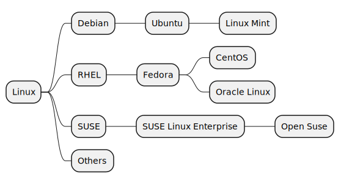

# what-are-the-most-common-linux-distribution-families

There are a lot of distros. 

## Red Hat Family Systems 

It uses the yum and dnf (RPM-based) package managers to install, update, or remove packages in the system.

## SUSE Family Systems

It uses the zypper (RPM-based) package manager.

## Debian Family Systems ( including Ubuntu and Linux Mint)

It uses the apt (Debian-based) package manager.

