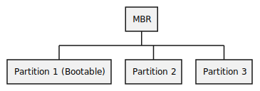

# What is Master Boot Record and Boot Loader

MBR is abbreviation of Master Boot Record which is a special type of boot sector at the beginning of hard drive. 

MBR is used to start the boot process of a computer's operating system.

MBR contains the boot loader, which is a small program that is responsible for loading the operating system.

When power on self test completed, the system control passes from the BIOS to the boot loader.

There are many boot loaders exist on linux;

 - GRUB ( for grand unitfied boot loader)
 - ISOLINUX ( for booting from removable media)
 - DAS U-BOOT ( for booting on embedded devices )

 

When booting, the boot loader is responsible for loading the kernel image and the initial RAM disk into memory.
