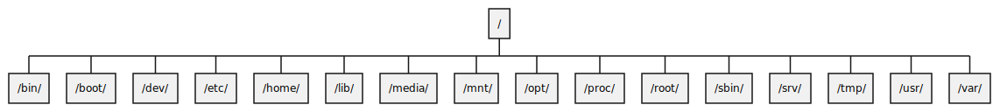

# Let's look into linux filesystem hierarchy 

At the linux, '/' (root directory ) is parent point of all files. 

There are many folders that use for different purpose under root directory.

## /bin/ folder

The /bin directory contains useful commands for everyone which is system admin and normal users.

- ls 
- pwd 
- cat
- top
- etc... 

## /boot/ folder

This directory contains static files for the boot process. kernel etc.

- System.map
- initrd.img
- vmlinuz
- config
- etc... 

-rw-r--r--  1 root root   236452 Dec 13 20:46 config-5.10.0-20-amd64
drwxr-xr-x  5 root root     4096 Dec 19 20:28 grub
-rw-r--r--  1 root root 29658693 Dec 19 20:28 initrd.img-5.10.0-20-amd64
-rw-r--r--  1 root root  7008928 Dec 13 20:46 vmlinuz-5.10.0-20-amd64

## /dev/ folder

This directory is location of device files.

Most of the file types are FIFO special file (a channel of communication between the two processes) which can be opened by multiple processes for reading or writing. When data exchanging there isn't content on file :)

- sda ( connected SCSI devices - hard drives HDD, scanners, printers ...)
- /disk directory has answers of about sda devices ( by-id, by-partuuid, by-path, by-uuuid) 

## /etc/ folder

## /home/ folder

## /lib/ folder

## /media/ folder

## /mnt/ folder

## /opt/ folder

## /proc/ folder

## /root/ folder

## /sbin/ folder

## /srv/ folder

## /tmp/ folder

## /usr/ folder

## /var/ folder

